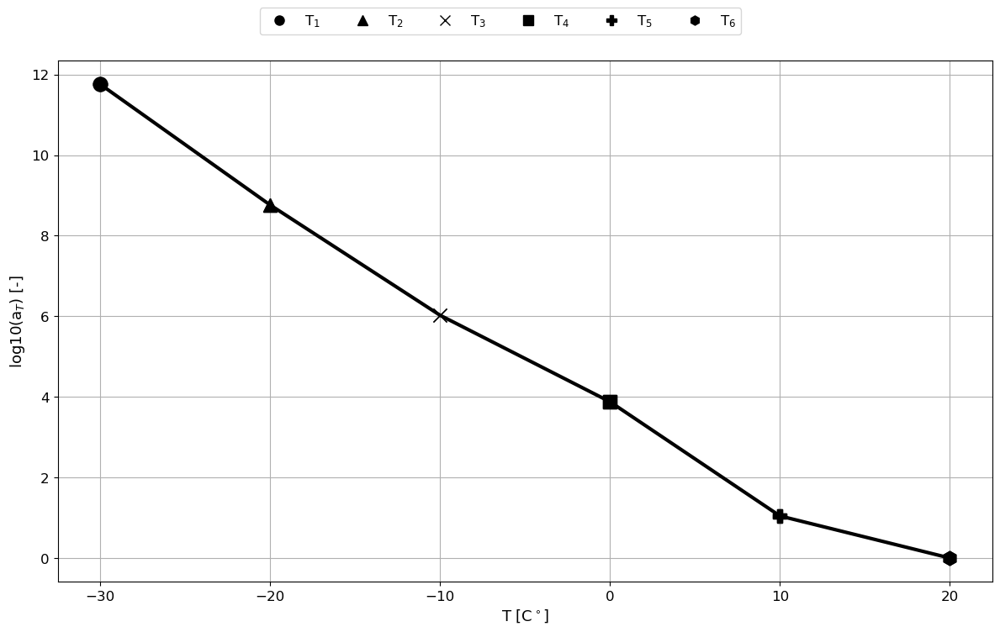
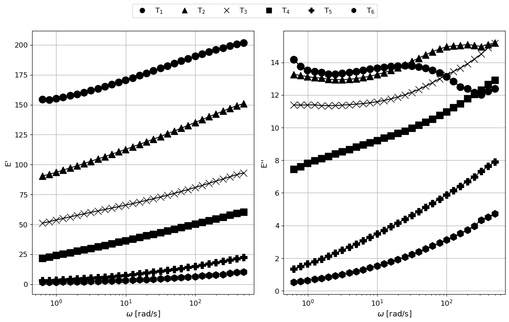
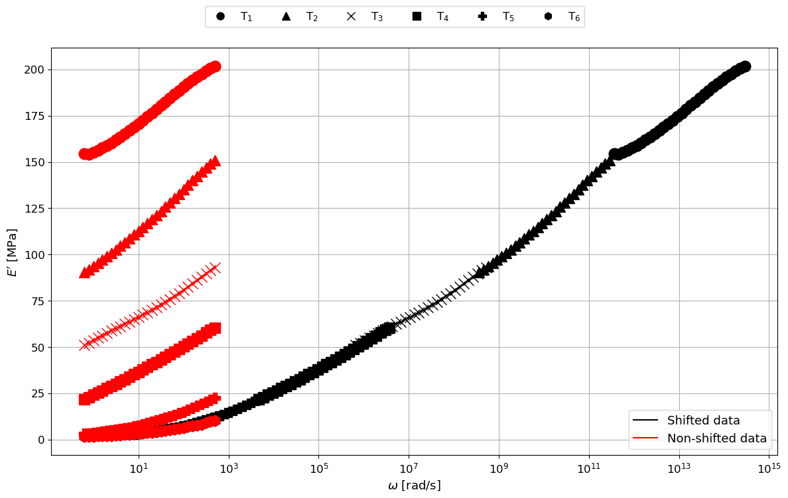
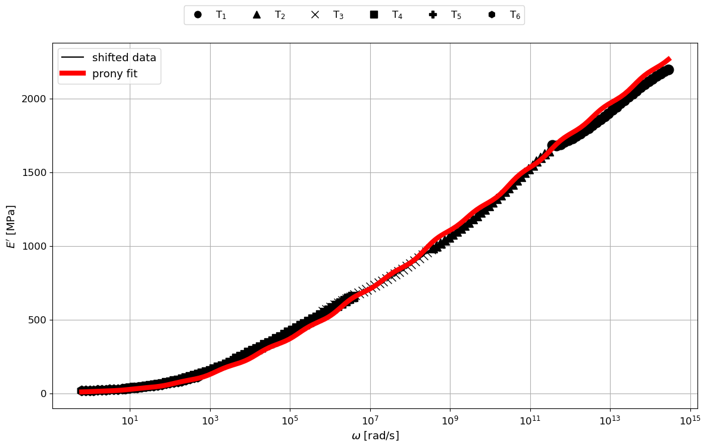

# viscoprony
**viscoprony** is a Python package for viscoelastic material modeling. It generates Prony-series coefficients from dynamic mechanical analysis (DMA) data to describe time-dependent behavior of polymers and other viscoelastic materials.

# Purpose
This tool streamlines the process of polymer and material characterization for FEA implementations (e.g., ABAQUS, ANSYS)

1. Building master curves using Time-Temperature Superposition (TTS)
2. Fitting Prony-series parameters (relaxation moduli and times) from DMA data
3. Visualizing shift factors, storage/loss moduli, and fitted curves

# Clone the repository
git clone [https://github.com/yourusername/viscoprony.git](https://github.com/MrJSimon/viscoprony.git)

# Navigate into the project folder
cd viscoprony

# Install in editable/development mode
pip install -e .

# Visualizations

**Shift Factors vs Temperature**: Logarithmic shift factors $a_T$ calculated from DMA data. 

  

**Storage and Loss Moduli**: Raw DMA curves showing $E'$ (storage modulus) and $E''$  (loss modulus).

  

**Master Curve**: Constructed master curve showing the material’s behavior over a wide frequency range.

  

**Prony-Series Fit**: Fitted Prony-series overlaying the master curve for validation.

  

